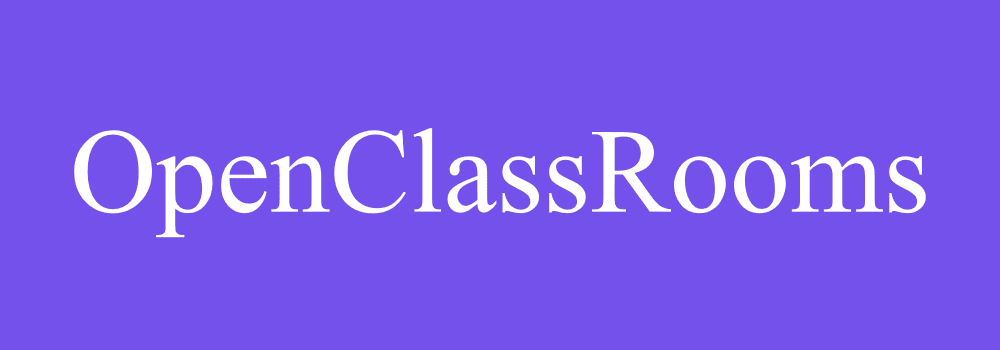
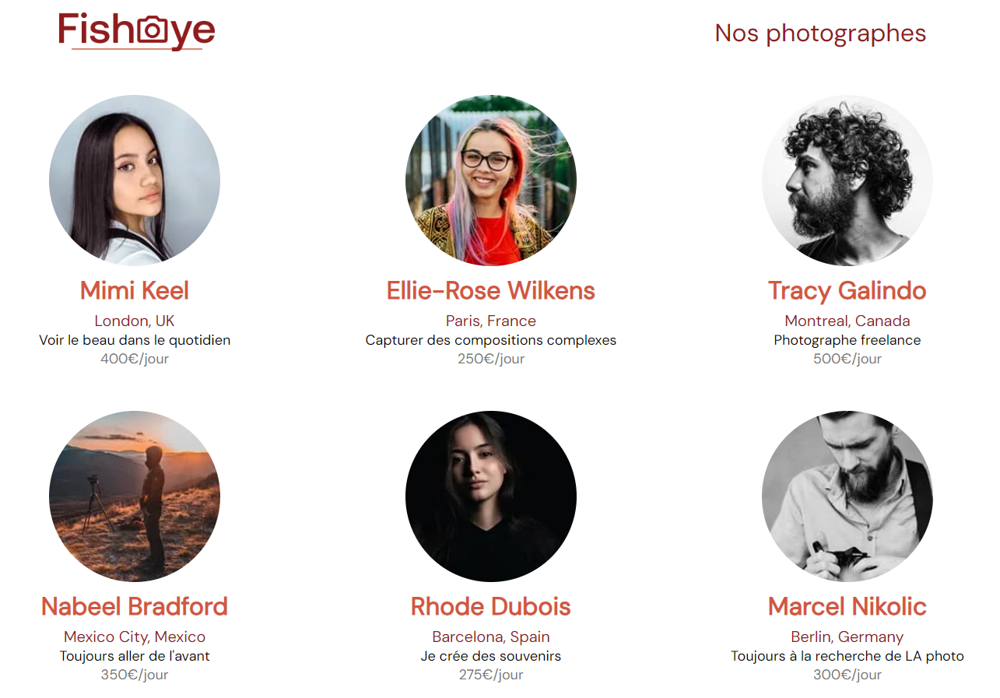
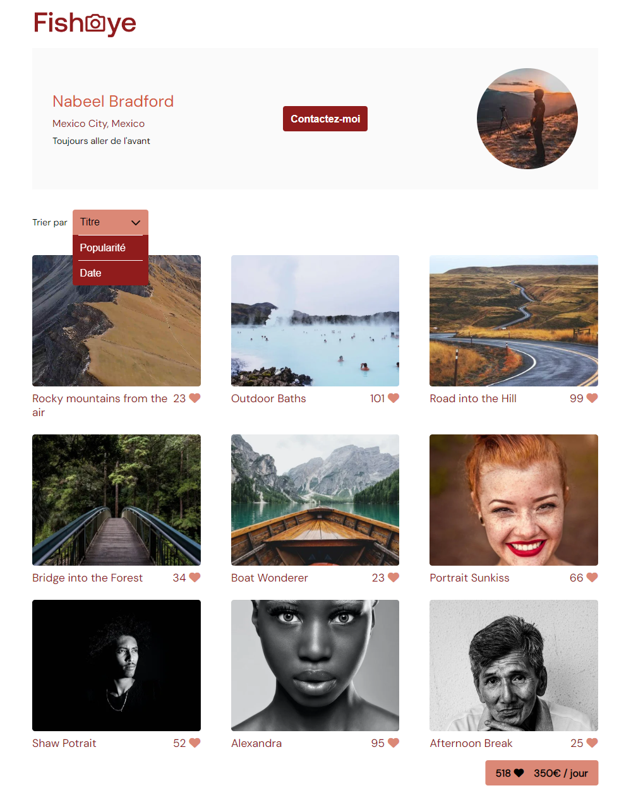

# Formation Développeur d'application - JavaScript React

## 📎 Projet 6 : Fisheye - Créez un site accessible pour une plateforme de photographes





## Technologies :
- HTML
- CSS
- Javascript

 

## Tester le projet :

```terminal
git clone https://github.com/Cyril-Develop/Fisheye.git
```
